# Задание 1. Yandex Cloud
### Настроить с помощью Terraform кластер баз данных MySQL

>Используя настройки VPC из предыдущих домашних заданий, добавить дополнительно подсеть private в разных зонах, чтобы обеспечить отказоустойчивость.\
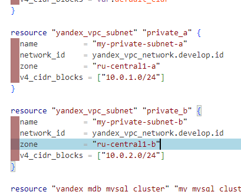

> Разместить ноды кластера MySQL в разных подсетях.\
> 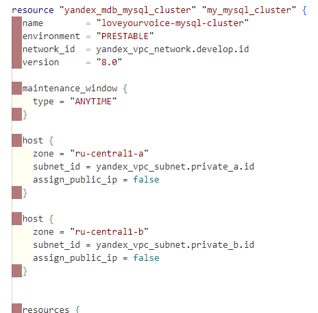

> Необходимо предусмотреть репликацию с произвольным временем технического обслуживания.\
> 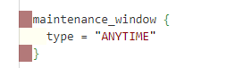

> Использовать окружение Prestable, платформу Intel Broadwell с производительностью 50% CPU и размером диска 20 Гб.\
> 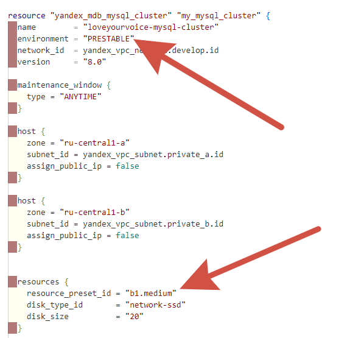

> Задать время начала резервного копирования — 23:59.\
> 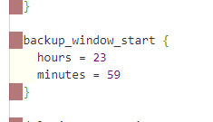

> Включить защиту кластера от непреднамеренного удаления.\
> 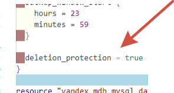
 
> Создать БД с именем netology_db, логином и паролем.\
> 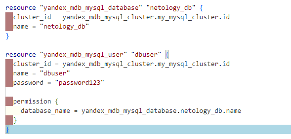
 
> Судя по plan проблемы вряд-ли возникнут, пока деплоить не буду, так как это занимает много времени, совершу деплой вместе со вторым заданием\
> 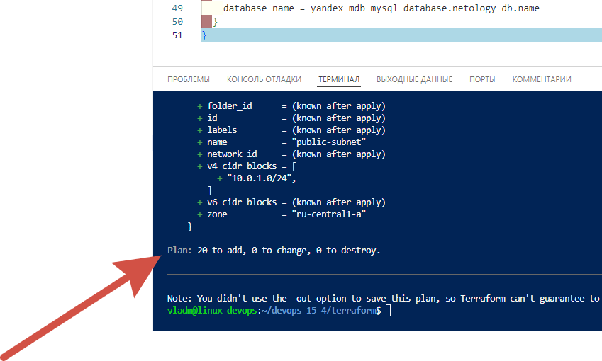

### Настроить с помощью Terraform кластер Kubernetes.
> Используя настройки VPC из предыдущих домашних заданий, добавить дополнительно две подсети public в разных зонах, чтобы обеспечить отказоустойчивость
> 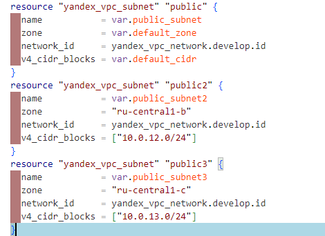

> Создать отдельный сервис-аккаунт с необходимыми правами.\
> 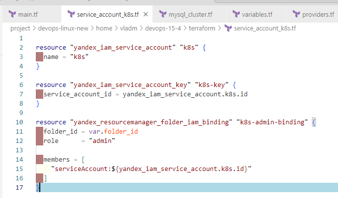

> Создать региональный мастер Kubernetes с размещением нод в трёх разных подсетях.
> 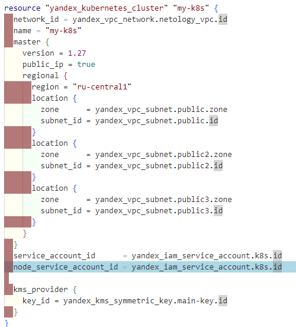

> Добавить возможность шифрования ключом из KMS, созданным в предыдущем домашнем задании.\
> 

> Создать группу узлов, состояющую из трёх машин с автомасштабированием до шести.
> 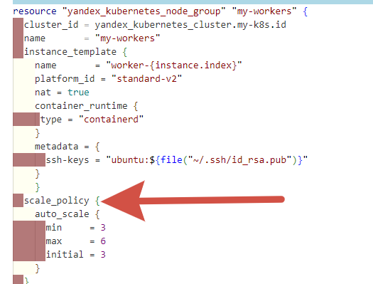

> Подключиться к кластеру с помощью kubectl.\
> При деплои возникли некоторые проблемы, например полурабочая C зона(изменил на d), а так же некоторые устаревшие параметры, скрины не стал переделывать, но все tf файлы доведены до идеала и отработали без ошибок, так же instance надо было разделить, по причине того что, автоскейл работает только в одной зоне.
> 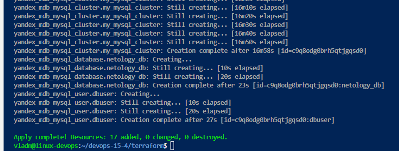
> 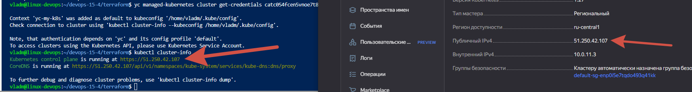

> *Запустить микросервис phpmyadmin и подключиться к ранее созданной БД.
> [pma](pma)

> *Создать сервис-типы Load Balancer и подключиться к phpmyadmin. Предоставить скриншот с публичным адресом и подключением к БД.
> 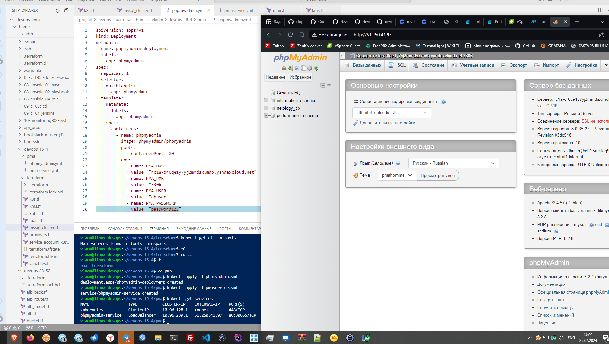